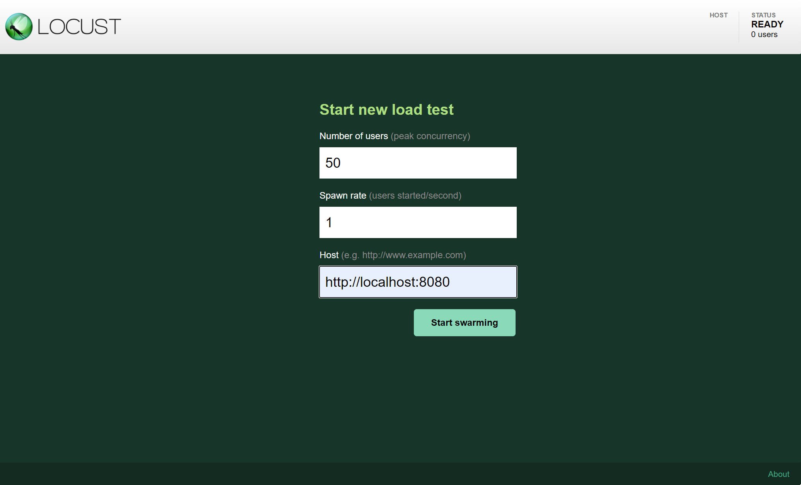
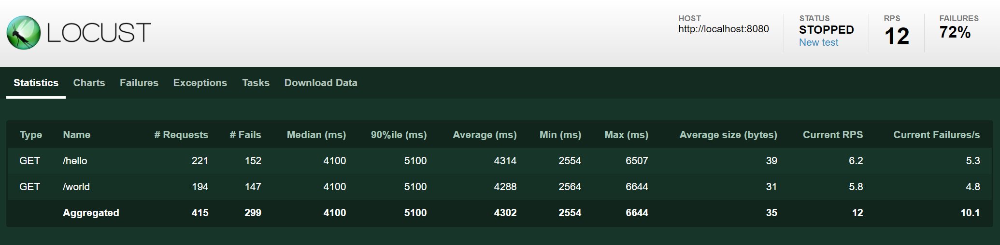
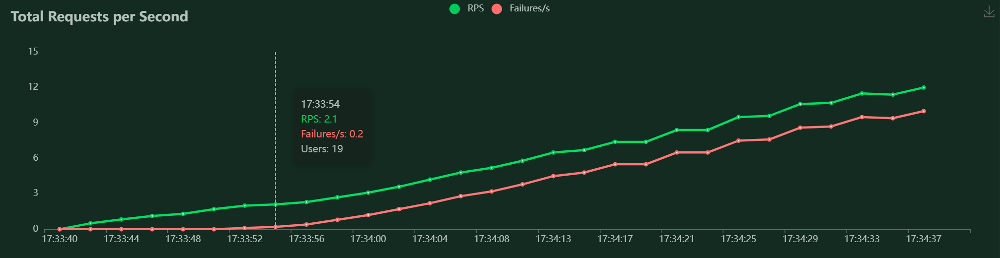
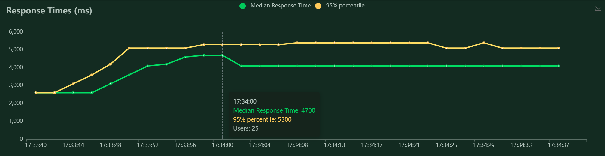
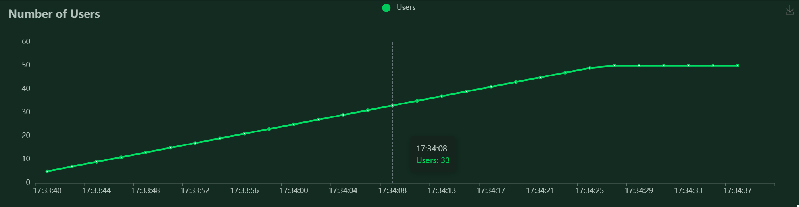

# TVVS - Performance Testing

# What is Locust?

Locust is an easy to use, scriptable and scalable performance testing tool.

You define the behavior of your users in regular Python code, instead of being stuck in a UI or restrictive domain specific language.

This makes Locust infinitely expandable and very developer friendly.

# Installation Guide

### 1. Install Python

[Install Python](https://docs.python-guide.org/starting/installation/) 3.6 or later, if you don't already have it. Also install `pip`.

```bash
# for Ubuntu/Debian
sudo apt-get install python3 python3-dev

# for fedora
sudo dnf install python3 python3-devel
```

### 2. Clone this repo

```bash
# clone the repo
git clone https://github.com/ricardofdc/TVVS-Performance-Testing.git

# change directory to project root
cd TVVS-Performance-Testing
```

### 3. Create python virtual environment (optional)

It is recommended to start a [python virtual environment](https://docs.python.org/3/tutorial/venv.html) to avoid problems with system dependencies:

```bash
# creating the environment (inside project root)
python3 -m venv env
```

Now it is important to activate the environment:

```bash
# UNIX & MaCOS
source env/bin/activate

# WINDOWS
env\Scripts\activate.bat
```

To make sure everything went well, try te following commands

```bash
which python
# the result should be something like this:
# /home/.../TVVS-Performance-Testing/env/bin/python
```

After you're done working on this project, simply run the following command to quit out of the virtual environment:

```bash
deactivate
```

### 4. Install Locust and other dependencies

Use pip to install project requirements on your virtual environment

```bash
pip install -r requirements.txt
```

Make sure that `locust` is installed and working:

```bash
locust -V
# locust 2.5.0
which locust
# /home/.../TVVS-Performance-Testing/env/bin/locust
```

You may need to run the command as admin or with the `--user` flag.  
Validate your installation. If this doesn't work, [check the Locust's wiki](https://github.com/locustio/locust/wiki/Installation) for some possible solutions.

Great! Now we're ready to create our first test.

# Exercises

We developed a very simple Python server for you to run locally, in order to perform the first exercise. Run this command in order to start that server:

```` bash
python server
````

Then, to do these exercises open a new terminal and run this command to change to the `exercises` folder:

```` bash
cd exercises
````

## 1. Getting started

A Locust test is essentially a Python program. This makes it very flexible and particularly good at implementing complex user flows. But it can do simple tests as well, so lets start with that:

```` py
from locust import HttpUser, task

class HelloWorldUser(HttpUser):
    @task
    def hello_world(self):
        self.client.get("/hello")
        self.client.get("/world")
````

This user will make HTTP requests to `/hello`, and then `/world`, again and again. 

Put the code in a file named *`locustfile.py`* in your current directory and run `locust`:

```` bash
locust
# [2021-12-06 16:08:50,336] .../INFO/locust.main: Starting web interface at http://0.0.0.0:8089
# [2021-12-06 16:08:50,357] .../INFO/locust.main: Starting Locust 2.5.0
````

> If you want to run locust with other files you can run the command `locust -f <file_name>.py`

### Locust's web interface

Once you’ve started Locust, open up a browser and point it to http://localhost:8089. You will be greeted with something like this:



Point the test at our simple Python web server and try it out!

The following screenshots show what it might look like when running this test targeting 50 concurrent users with a ramp up speed of 1 users/s.



Locust can also visualize the results as charts, showing things like requests per second (RPS):



Response times (in milliseconds):



Number of users:



## 2. Test E-Commerce System

An e-commerce system has launched about a week ago (https://www.demoblaze.com/), and after the first week the following data was collected:

- Average online users: **50**
- Average requests per second: **30**

**System Requirements**

The owner of this system told us that it has the following non-functional performance requirements:

**1.** The system must successfully answer at least 98% of incoming requests.

<details>
    <summary>💡 Hint</summary>
    A simple load test with the system collected data should suffice
</details>


---

**2.** During black-friday (which lasts for 24 hours) the system's usage is expected to grow 100% (100 online users and about 60 requests per second). During this time, the system much reply successfully to at least 95% of incoming requests.

<details>
    <summary>💡 Hint</summary>
    Look at the slides and try to draw a RPS curve that resembles a stress testing curve!
</details>

---

**3.** Besides black friday, the store also does flash sales that last about 1 hour. These flash days usually happen 6 times a day and causes the website's activity to grow 200% during these hours.

<details>
    <summary>💡 Hint</summary>
    Maybe try a peak testing approach!
</details>

However the owner is not entirely sure that these requirements are met. For each non-functional requirement, write a performance test using the locust library.

You can find hints after each requirement and a step-by-step guide bellow to help you if you want!

### 2.1. Load Test

>WIP - We are working on the best guides

### 2.2. Stress Test

>WIP - We are working on the best guides

### 2.3. Peak Test

>WIP - We are working on the best guides

### 2.4. Breakpoint Test

>WIP - We are working on the best guides

# References

[Locust Documentation - Locust 2.5.0 documentation](https://docs.locust.io/en/stable/index.html)
