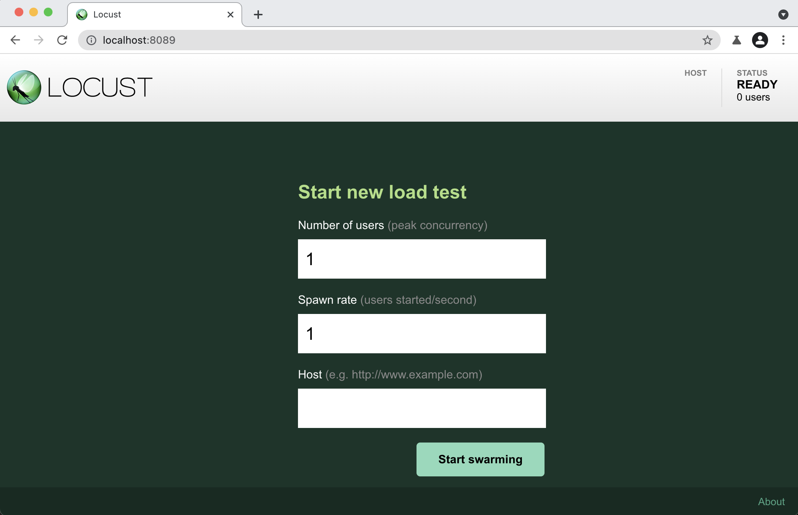

# TVVS - Performance Testing

# What is Locust?

Locust is an easy to use, scriptable and scalable performance testing tool.

You define the behaviour of your users in regular Python code, instead of being stuck in a UI or restrictive domain specific language.

This makes Locust infinitely expandable and very developer friendly.

# Installation Guide

Clone this repository:

```` shell
$ git clone https://github.com/ricardofdc/TVVS-Performance-Testing.git
````

[Install Python](https://docs.python-guide.org/starting/installation/) 3.6 or later, if you don't already have it.

Install Locust:

```` shell
$ pip3 install locust
````

You may need to run the command as admin or with the `--user` flag.  
Validate your installation. If this doesn't work, [check the Locust's wiki](https://github.com/locustio/locust/wiki/Installation) for some possible solutions.

```` shell
$ locust -V
locust 2.5.0
````

Great! Now we're ready to create our first test.

# Tutorial

We developed a very simple Python server for you to run locally, in order to perform the first test. Run this command in order to start that server:

```` shell
$ py server
````

Then, to do this tutorial open a new terminal and run this command to change to the `tutorial` folder:

```` shell
$ cd tutorial
````

## 1. Getting started

A Locust test is essentially a Python program. This makes it very flexible and particularly good at implementing complex user flows. But it can do simple tests as well, so lets start with that:

```` py
from locust import HttpUser, task

class HelloWorldUser(HttpUser):
    @task
    def hello_world(self):
        self.client.get("/hello")
        self.client.get("/world")
````

This user will make HTTP requests to /hello, and then /world, again and again. 

Put the code in a file named *`locustfile.py`* in your current directory and run `locust`:

```` shell
$ locust
[2021-12-06 16:08:50,336] .../INFO/locust.main: Starting web interface at http://0.0.0.0:8089
[2021-12-06 16:08:50,357] .../INFO/locust.main: Starting Locust 2.5.0
````

### Locust's web interface

Once you’ve started Locust, open up a browser and point it to http://localhost:8089. You will be greeted with something like this:



# References

[Locust Documentation - Locust 2.5.0 documentation](https://docs.locust.io/en/stable/index.html)
