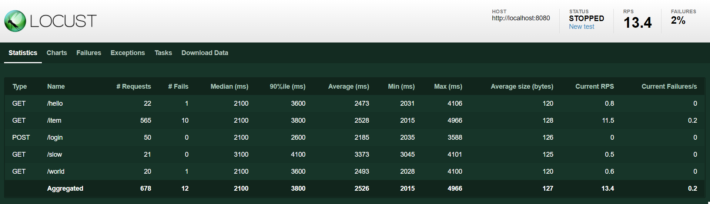
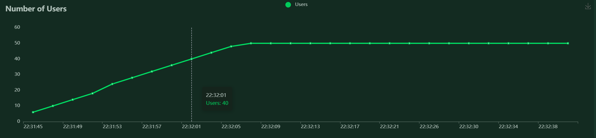
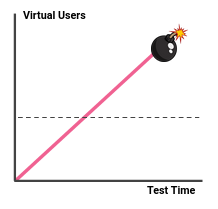

# TVVS - Performance Testing

- Gonçalo Marantes - up201706917@edu.fe.up.pt
- Ricardo Cardoso - up201604686@edu.fe.up.pt
- Tiago Silva - up201705985@edu.fe.up.pt
# Index

- [What is Locust?](#what-is-locust)
- [Installation Guide](#installation-guide)
    - [1. Install Python](#1-install-python)
    - [2. Clone our repository](#2-clone-our-repository)
    - [3. Create python virtual environment (optional)](#3-create-python-virtual-environment-optional)
    - [4. Install Locust and other dependencies](#4-install-locust-and-other-dependencies)
- [Exercises](#exercises)
    - [1. Getting started](#1-getting-started)
        - [1.1 Creating tasks](#11-creating-tasks)
        - [1.2 Creating Users (threads)](#12-creating-users-threads)
        - [1.3 Creating Test Shapes](#13-creating-test-shapes)
        - [1.4 Wrapping it up altogether](#14-wrapping-it-up-altogether)
    - [2. Locust's web interface](#2-locusts-web-interface)
    - [3. Test E-Commerce System](#3-test-e-commerce-system)
        - [3.1 System Requirements](#31-system-requirements)
        - [3.2 Challenge](#32-challenge)
- [Exercise Guides](#exercise-guides)
    - [1. Load Test Guide](#1-load-test-guide)
    - [2. Stress Test Guide](#2-stress-test-guide)
    - [3. Spike Test Guide](#3-spike-test-guide)
    - [4. Breakpoint Test Guide](#4-breakpoint-test-guide)

# What is Locust?

Locust is an easy to use, scriptable and scalable performance testing tool.

You define the behavior of your users in regular Python code, instead of being stuck in a UI or restrictive domain specific language.

This makes Locust infinitely expandable and very developer friendly.

# Installation Guide

## 1. Install Python

Install [`Python`](https://docs.python-guide.org/starting/installation/) 3.6 or later, if you don't already have it.

```bash
# for Ubuntu/Debian
sudo apt-get install python3 python3-dev

# for fedora
sudo dnf install python3 python3-devel
```

[`pip`](https://pip.pypa.io/en/stable/installation/) usually comes bundled with Python, but make sure you have it installed anyway.

```bash
pip -V
# pip 21.2.4 from /home/.../python3.X/site-packages/pip (python 3.X)
```

## 2. Clone our repository

Clone [this](https://github.com/ricardofdc/TVVS-Performance-Testing) GitHub repository, with the following command:

```bash
# clone the repo
git clone https://github.com/ricardofdc/TVVS-Performance-Testing.git

# change directory to project root
cd TVVS-Performance-Testing
```

## 3. Create python virtual environment (optional)

It is recommended to start a [python virtual environment](https://docs.python.org/3/tutorial/venv.html) to avoid problems with system dependencies. However, this is optional and everything should work fine either way.

```bash
# creating the environment (inside project root folder)
python3 -m venv env
```

Now your project folder will look something like this:

```
.
├── demo
│  ├── breakpoint_testing.py
│  ├── load_testing.py
│  ├── locustfile.py
│  ├── spike_testing.py
│  └── user_task_set.py
├── docs
│  ├── img
│  └── performance-testing-install-guide.pdf
├── env <- ⚠️ NOTICE THIS FOLDER! ⚠️
│  ├── bin
│  ├── include
│  ├── lib
│  ├── lib64 ⇒ lib
│  └── pyvenv.cfg
├── exercises
│  ├── ex1.py
│  ├── ex2.py
│  ├── ex3.py
│  ├── ex4.py
│  ├── getting_started.py
│  └── tasks.py
├── install.md
├── README.md
├── requirements.txt
└── server
   └── __main__.py
```

Now it is important to activate the environment:

```bash
# UNIX & MaCOS
source env/bin/activate

# WINDOWS
env\Scripts\activate.bat
```

To make sure everything went well, try the following command (UNIX only):

```bash
which python
# the result should be something like this:
# /home/.../TVVS-Performance-Testing/env/bin/python
```

After you're done working on this project, simply run the following command to quit out of the virtual environment:

```bash
deactivate
```

## 4. Install Locust and other dependencies

Use pip to install project requirements on your virtual environment

```bash
pip install -r requirements.txt
```

Make sure that `locust` is installed and working:

```bash
locust -V
# locust 2.5.0
```

You may need to run the command as admin or with the `--user` flag.  
Validate your installation. If this doesn't work, [check the Locust's wiki](https://github.com/locustio/locust/wiki/Installation) for some possible solutions.

Great! Now we're ready to create our first test.


# Exercises

We developed a very simple Python server for you to run locally, in order to perform the first exercise. Run this command in order to start that server:

```` bash
python server
````

Then, to do these exercises open a new terminal and run this command to change to the `exercises` folder:

```` bash
cd exercises
````

## 1. Getting started

A Locust test is essentially a Python program. This makes it very flexible and particularly good at implementing complex user flows. But it can do simple tests as well, so let's start with that.

### 1.1 Creating tasks

Let's define the tasks that the User will perform in this service:

```` py
from locust import TaskSet, HttpUser, LoadTestShape, task, constant
import time

class MyUserTaskSet(TaskSet):

    # A method with the name "on_start" will be called for each 
    # simulated user when they start.
    def on_start(self):
        self.client.post("/login", json={"username":"foo", "password":"bar"})

    # Methods decorated with @task are the core of your locust file. 
    # For every running user, Locust creates a greenlet (micro-thread), 
    # that will call those methods.
    @task
    def hello_world(self):
        self.client.get("/hello")
        self.client.get("/world")

    @task
    def slow(self):
        self.client.get("/slow")

    @task(3)
    def view_items(self):
        # Here we will load 10 different URLs by using a variable query 
        # parameter. In order to not get 10 separate entries in Locust's 
        # statistics we use the name parameter to group all those requests 
        # under an entry named "/item" instead.
        for item_id in range(10):
            self.client.get(f"/item?id={item_id}", name="/item")
            time.sleep(1)

````

We’ve declared three tasks by decorating three methods with `@task`, one of which has been given a higher weight (3). When our `MyUser` runs it’ll pick one of the declared tasks - in this case, either `hello_world`, `slow` or `view_items` - and execute it. Tasks are picked at random, but you can give them different weights. The above configuration will make Locust three times more likely to pick `view_items` than `hello_world` or `slow`. When a task has finished executing, the User will then sleep during its wait time (we will talk about this later). After its wait time it’ll pick a new task and keep repeating that.

### 1.2 Creating Users (threads)

Now let's create a new kind of user, that will send requests to `localhost:8080`:

```` py
class MyUser(HttpUser):
    # default host
    host = "http://localhost:8080"
    
    # Here we will define the waiting time between the user's tasks
    #
    # With `wait_time` = constant(0.5) this user will execute 
    # its tasks with constant interval of 0.5 seconds between each
    # task.
    #
    # Another way we can specify the wait time is with
    # between(). With `wait_time` = between(1, 5), the user
    # will execute its tasks with a random interval between 1
    # and 5 seconds.
    wait_time = constant(0.5)

    # The tasks array defines the tasks that will be executed
    # by this user. In this case, the array as an element which
    # is an instance of MyUserTaskSet. So this user will execute
    # the tasks defined in the MyUserTaskSet class
    tasks = [MyUserTaskSet]
````

Further information about the `User` class can be found [here](http://docs.locust.io/en/stable/writing-a-locustfile.html#user-class)

### 1.3 Creating Test Shapes

Now that we have created our tasks and users, we need to create the shape of our test curve. Depending on the type of test we want to perform (load, spike, endurance, etc.) we need to configure a custom shape.

Let's a look at a very basic example:

```python
class MyLoadTestShape(LoadTestShape):
    # the duration of the test
    time_limit = 60
    # max number of users
    max_users = 50
    # Number of users to start/stop per second
    spawn_rate = 2

    # the tick() method returns either:
    #  - a tuple containing:
    #     1. maximum number of users
    #     2. user spawn or de-spawn rate (users per second)
    #  - None, ending the test
    # This method is called approximately every second.
    def tick(self):
        # get time elapsed (in seconds)
        run_time = round(self.get_run_time())

        # check if time limit has been reached
        if run_time < self.time_limit:
            return (self.max_users, self.spawn_rate)
        else:
            return None
```

In this example, for every instance of the test, there will be a maximum number of 50 users, which increase at a rate of 2 users per second. So at the beginning of the test there are 0 users, after 25 seconds, there are 50 users. And since this method returns `None` after 60 seconds, then the test will automatically stop.

### 1.4 Wrapping it up altogether

Place all this the code in a file named `locustfile.py` in your current directory and run `locust`:

```` bash
locust
# [2021-12-06 16:08:50,336] .../INFO/locust.main: Starting web interface at http://0.0.0.0:8089
# [2021-12-06 16:08:50,357] .../INFO/locust.main: Starting Locust 2.5.0
````

If you want to run locust with other files you can run the command:

```bash
locust -f <file_name>.py
```

## 2. Locust's web interface

Once you’ve started Locust, open up a browser and point it to http://localhost:8089. You will be greeted with something like this:


Point the test at our simple Python web server and try it out!

The following screenshots show what it might look like when running this test targeting 50 concurrent users with a ramp-up the speed of 2 users/s, during 60 seconds.



Locust can also visualize the results as charts, showing things like requests per second (RPS):


Response times (in milliseconds):


Number of users:



## 3. Test E-Commerce System

An e-commerce system is set to launch in the near future.

The developers of this website have created a test environment just for us. ❤️
This environment is available at: https://www.demoblaze.com/.

After some discussion with the store owners, they estimate the following system activity:

- Average online users: **50**
- Average requests per second: **30**

⚠️ The average user's behavior is already set up for you in `exercises/tasks.py`, but feel free to change it ⚠️

### 3.1 System Requirements

The owner of this system told us that it had the following non-functional performance requirements:

**1.** The system must successfully answer at least 98% of incoming requests during an average load.

<details>
    <summary>💡 Hint</summary>
    A simple load test with the system collected data should be enough.
</details>


---

**2.** During Black Friday (which lasts for 24 hours) the system's usage is expected to grow 100% (100 online users and about 60 requests per second). During this time, the system should reply successfully to at least 95% of incoming requests.

<details>
    <summary>💡 Hint</summary>
    Look at the slides and try to develop a test capable of drawing a Requests per Second (RPS) curve that resembles a stress testing curve!
</details>

---

**3.** Besides Black Friday, the store also does some flash sales that last about 1 hour. These flash sales usually happen 6 times a day and cause the website's activity to grow 300%. During this time the system should be able to reply successfully to at least 90% of incoming requests.

<details>
    <summary>💡 Hint</summary>
    In this case, developing a spike test may be the best testing approach!
</details>

---

However, the owner is not entirely sure that these requirements are met and needs you to test them. For each non-functional requirement, write a performance test using the locust library.

You can find hints after each requirement and a guide to some of the tasks below to help you if you want!

### 3.2 Challenge

Find out when the system stops answering more than 50% of incoming requests!

# Exercise guides

## 1. Load Test Guide


One of the key parts of load testing is to never go over the threshold line. So carefully read the exercise description about this topic.

Moreover, it is necessary to keep a constant flow of system activity over a considerable amount of time, after that it will die down.

Here is an example of such behavior:

```python
class LoadStagesShape(LoadTestShape):
    # test will run for 120 seconds
    time_limit = 120
    # max number of users
    max_users = 30
    # curve starts going down after 100 seconds
    end_load =  100
    # Number of users to start/stop per second
    spawn_rate = 5

    def tick(self):
        run_time = round(self.get_run_time())

        user_count = self.max_users if run_time < self.end_load else 0

        if run_time < self.time_limit:
            return (user_count, self.spawn_rate)
        else:
            return None
```
## 2. Stress Test Guide


Same as the Load test, just increase the number of users OR decrease the `wait_time` between user tasks.

## 3. Spike Test Guide


When performing a Spike test you have system activity peaks that occur over very short time periods. The following example shows a simple way to achieve this behavior, but we believe you can do better! 👏

```python
class SpikeStagesShape(LoadTestShape):
    """
    A simply load test shape class that has different user and spawn_rate at
    different stages.
    Keyword arguments:
        stages -- A list of dicts, each representing a stage with the following keys:
            duration -- When this many seconds pass the test is advanced to the next stage
            users -- Total user count
            spawn_rate -- Number of users to start/stop per second
    """

    stages = [
        {"duration": 45, "users": 5, "spawn_rate": 100},    # 0   - 45
        {"duration": 60, "users": 100, "spawn_rate": 100},  # 45  - 60  - peak
        {"duration": 105, "users": 5, "spawn_rate": 100},   # 60  - 105
        {"duration": 120, "users": 100, "spawn_rate": 100}, # 105 - 120 - peak
        {"duration": 165, "users": 5, "spawn_rate": 100},   # 120 - 165
        {"duration": 180, "users": 100, "spawn_rate": 100}, # 165 - 180 - peak
        {"duration": 225, "users": 5, "spawn_rate": 100},   # 180 - 225
        {"duration": 240, "users": 100, "spawn_rate": 100}, # 225 - 240 - peak
        {"duration": 285, "users": 5, "spawn_rate": 100},   # 240 - 285
    ]

    def tick(self):
        run_time = self.get_run_time()

        for stage in self.stages:
            if run_time < stage["duration"]:
                tick_data = (stage["users"], stage["spawn_rate"]) # spawn rate is always 100
                return tick_data

        return None
```

## 4. Breakpoint Test Guide



Keep increasing users over time. How about something like this:

```Python
class BreakpointShape(LoadTestShape):
    # max number of users
    max_users = sys.maxsize
    # Number of users to start/stop per second
    spawn_rate = 5

    def tick(self):
        # no time-limit
        return (self.max_users, self.spawn_rate)
```

# References

[Locust Documentation - Locust 2.5.0 documentation](https://docs.locust.io/en/stable/index.html)
